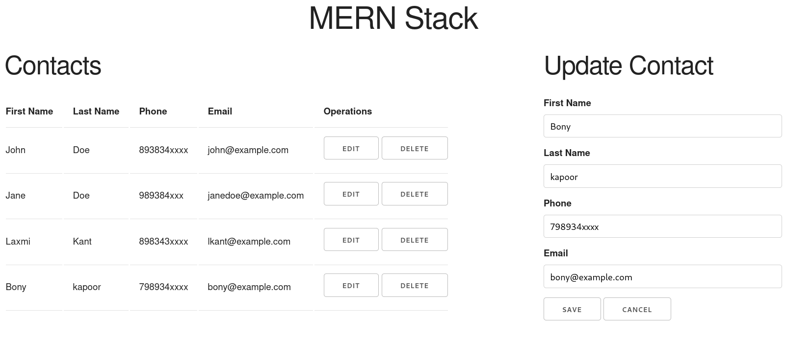
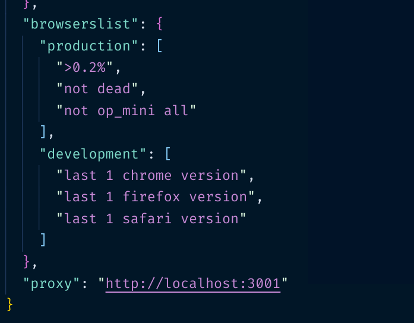

Building a basic contact web application using MongoDB, Express, React and Node (MERN Stack). Here we'll create RESTful api for CRUD operations to mongodb server and user interface using React.

## Part2: Front-end/client-side(React)

[Part1: Back-end/server-side (Express/Node/Mongodb)](/blog/building-basic-contact-web-application-using-mern-stack-crud-operations-part1)

[Part2: Front-end/client-side (React)](/blog/building-basic-contact-web-application-using-mern-stack-restful-api-crud-operations-part2)

In the [second part]((/blog/building-basic-contact-web-application-using-mern-stack-restful-api-crud-operations-part2)) of the tutorial we are going to create front-end(user interface) for our basic contact web application.

### Prerequisites

[node.js](https://nodejs.org/en/download/)

[MongoDB server](https://www.mongodb.com/download-center/community)

### Initializing the client side

From the root of `mern-stack-contact-app` project directory

```bash
$ npx create-react-app client
```

npx will create a react application `client`

> You need not install create-react-app locally or globally.

After getting installed we need to add `proxy` in `package.json` file of client directory/project.

**Add the property at the end of client/package.json**
```json
"proxy": "http://localhost:3001"
```


*Remove all the files from `client/src` directory*

**Super!**

create `App.js` and `index.js` files in `client/src` directory

Here is the code for `index.js` where we simply rendering our `App` component

**index.js**
```js
import React from "react";
import ReactDOM from "react-dom";

import App from "./App";

ReactDOM.render(<App />, document.getElementById("root"));
```
- We are using [skeleton](https://getskeleton.com) css library to style our application.

In order to use skeleton css classes we need to add skeleton cdn to `index.html` in `client/public` directory

Remove all the files from `client/public` directory and create `index.html` with following code

**index.html**
```html
<!DOCTYPE html>
<html lang="en">
  <head>
    <meta charset="UTF-8" />
    <link
      rel="stylesheet"
      href="https://cdnjs.cloudflare.com/ajax/libs/skeleton/2.0.4/skeleton.min.css"
    />
    <meta name="viewport" content="width=device-width, initial-scale=1.0" />
    <title>MERN Stack</title>
  </head>
  <body>
    <div id="root"></div>
  </body>
</html>
```

Fine!

We're going to get `App` componet 

Wait... 

What! we need to use hooks. nope! no problem :)

**App.js**
```js
import React, { useState, useEffect } from "react";

const App = () => {
  // to store contacts  before rendering
  const [contacts, setContacts] = useState([]);
  
  // fetching the contacts list from the server
  useEffect(() => {
    fetch("http://localhost:3001/contacts")
      .then((remoteContacts) => remoteContacts.json())
      .then((remoteContacts) => setContacts(remoteContacts));
  }, []);
 
//  we'll come back later here

}

export default App;
```

Let's create a component to display the contact list

Create a directory `components` in the root of `client/src` directory 

Add `ContactTable.js` file in components directory

**ContactTable.js**
```js
import React from "react";

const ContactTable = (props) => {
  return (
    <table width="u-full-width">
      <thead>
        <tr>
          <th>First Name</th>
          <th>Last Name</th>
          <th>Phone</th>
          <th>Email</th>
          <th>Operations</th>
        </tr>
      </thead>
      <tbody>
        {props.contacts.length > 0 ? (
          props.contacts.map((contact) => {
            const { _id, firstname, lastname, phone, email } = contact;
            return (
              <tr key={_id}>
                <td>{firstname}</td>
                <td>{lastname}</td>
                <td>{phone}</td>
                <td>{email}</td>
                <td>
                  <button onClick={() => props.editContact(contact)}>
                    Edit
                  </button>{" "}
                  <button onClick={() => props.deleteContact(_id)}>
                    Delete
                  </button>
                </td>
              </tr>
            );
          })
        ) : (
          <tr>
            <td>No record found</td>
          </tr>
        )}
      </tbody>
    </table>
  );
};

export default ContactTable;

```
`ContactTable` component accepts props and maps contact list in a tabular format. 

Cool :)

Let's have the user interface for creating contact - add `AddContactForm.js` to the `components` directory

**AddContactForm.js**
```js
import React, { useState } from "react";

const AddContactForm = (props) => {
  // to initialize the form fields before and after creating contact
  const initContact = {
    firstname: "",
    lastname: "",
    phone: "",
    email: "",
  };

  const [contact, setContact] = useState(initContact);

  //  collecting the data
  const handleChange = (e) => {
    const { name, value } = e.target;
    setContact({ ...contact, [name]: value });
  };

  // passing the contact to addContact function which we accessed using props
  const handleSubmit = (e) => {
    e.preventDefault();
    if (contact.firstname && contact.lastname && contact.phone && contact.email)
      props.addContact(contact);
    setContact(initContact);
  };

  return (
    <form>
      <label>First Name</label>
      <input
        type="text"
        name="firstname"
        onChange={handleChange}
        value={contact.firstname}
        className="u-full-width"
      />
      <label>Last Name</label>
      <input
        type="text"
        name="lastname"
        onChange={handleChange}
        value={contact.lastname}
        className="u-full-width"
      />
      <label>Phone</label>
      <input
        type="text"
        name="phone"
        onChange={handleChange}
        value={contact.phone}
        className="u-full-width"
      />
      <label>Email</label>
      <input
        type="text"
        name="email"
        onChange={handleChange}
        value={contact.email}
        className="u-full-width"
      />
      <button type="submit" className="primary-button" onClick={handleSubmit}>
        Create
      </button>
    </form>
  );
};

export default AddContactForm;
```

Add `EditContactForm.js` to the `components` directory, so that we can update contact data

This is almost similar as `AddContactForm` 

**EditContactForm.js**
```js 
import React, { useState, useEffect } from "react";

const EditContactForm = (props) => {
  // Getting existing data via props
  const [contact, setContact] = useState(props.currentContact);

  // this reflects change in currentContact(to be edited) if any of the props passed to this component change
  useEffect(() => {
    setContact(props.currentContact);
  }, [props]);

  const handleChange = (e) => {
    const { name, value } = e.target;
    setContact({ ...contact, [name]: value });
  };

  const handleSubmit = (e) => {
    e.preventDefault();
    if (contact.firstname && contact.lastname && contact.phone && contact.email)
      props.updateContact(contact);
  };

  return (
    <form>
      <input
        type="hidden"
        name="_id"
        onChange={handleChange}
        value={contact._id}
        className="u-full-width"
      />
      <label>First Name</label>
      <input
        type="text"
        name="firstname"
        onChange={handleChange}
        value={contact.firstname}
        className="u-full-width"
      />
      <label>Last Name</label>
      <input
        type="text"
        name="lastname"
        onChange={handleChange}
        value={contact.lastname}
        className="u-full-width"
      />
      <label>Phone</label>
      <input
        type="text"
        name="phone"
        onChange={handleChange}
        value={contact.phone}
        className="u-full-width"
      />
      <label>Email</label>
      <input
        type="text"
        name="email"
        onChange={handleChange}
        value={contact.email}
        className="u-full-width"
      />
      <button type="submit" className="primary-button" onClick={handleSubmit}>
        Save
      </button>{" "}
      <button
        type="submit"
        className="primary-button"
        onClick={() => props.setEditing(false)}
      >
        Cancel
      </button>
    </form>
  );
};

export default EditContactForm;
```


Good! We need to add some functions to `App.js` which are passed as props to `ContactTable.js`, `AddContactForm.js` and `EditContactForm.js`

**App.js**
```js
import React, { useState, useEffect } from "react";

// importing the components so that we can pass functions as props
import ContactTable from "./components/ContactTable";
import AddContactForm from "./components/AddContactForm";
import EditContactForm from "./components/EditContactForm";

const App = () => {
  const [contacts, setContacts] = useState([]);
  // this'll ensure whether AddContactForm or EditContactForm will be displayed
  const [editing, setEditing] = useState(false);

  // setting initial currentContact
  const initialContact = {
    firstname: "",
    lastname: "",
    phone: "",
    email: "",
  };

  // to have contact ready to be sent for editing
  const [currentContact, setCurrentContact] = useState(initialContact);

  // fetching the contact list from the server
  useEffect(() => {
    fetch("http://localhost:3001/contacts")
      .then((remoteContacts) => remoteContacts.json())
      .then((remoteContacts) => setContacts(remoteContacts));
  }, []);

  //creating the contact by sending the data(as json) using post http method
  const addContact = (contact) => {
    setContacts([...contacts, contact]);

    fetch("http://localhost:3001/contacts/create", {
      method: "post",
      headers: {
        "content-type": "application/json",
      },
      body: JSON.stringify(contact),
    });
    console.log(contact);
  };

  // 1. setting contact data (received from ContactTable component) to the currentContact so that data can be sent to EditContactForm
  // 2. setting the editing mode
  const editContact = (contact) => {
    setCurrentContact(contact);
    setEditing(true);
  };

  // 1. To update contact data using put http method
  // 2. unsetting the editing mode 
  const updateContact = (newContact) => {
    setContacts(
      contacts.map((contact) =>
        contact._id === newContact._id ? newContact : contact
      )
    );
    setEditing(false);

    fetch("http://localhost:3001/contacts/update", {
      method: "put",
      headers: {
        "content-type": "application/json",
      },
      body: JSON.stringify(newContact),
    });
  };

  // to delete resource(contact) by sending delete http request method
  const deleteContact = (_id) => {
    setContacts(contacts.filter((contact) => contact._id !== _id));

    fetch("http://localhost:3001/contacts/delete", {
      method: "delete",
      headers: {
        "content-type": "application/json",
      },
      body: JSON.stringify({ _id }),
    });
  };

  return (
    
    <div className="container-fluid">
      <h1 style={{ textAlign: "center" }}>MERN Stack</h1>
      <div className="row">
        <div className="columns eight">
          <h2>Contacts</h2>
          <ContactTable
            contacts={contacts}
            deleteContact={deleteContact}
            editContact={editContact}
          />
        </div>
        <div className="columns four">
          {editing ? (
            <>
              <h2>Update Contact</h2>
              <EditContactForm
                currentContact={currentContact}
                updateContact={updateContact}
                setEditing={setEditing}
              />
            </>
          ) : (
            <>
              <h2>Add Contact</h2>
              <AddContactForm addContact={addContact} />
            </>
          )}
        </div>
      </div>
    </div>
  );
};

export default App;
```

Almost completed!

We need to run back-end and front-end concurrently

Stop(ctrl+c) if backend server is running

**Let's get to the root of `mern-stack-contact-app` directory (not in client)**

Run the contact application (remember the scripts of `package.json` ~ server-side)

```bash
$ npm run start
```

Congratulations! 👍


[Part1: Back-end/server-side (Express/Node/Mongodb)](/blog/building-basic-contact-web-application-using-mern-stack-crud-operations-part1)

If you have any question related to this post **[discuss here](https://twitter.com/avinashkumar_2/status/1271618727855796224)**

**[Download/Clone the Source Code](https://github.com/Codanv/mern-stack-contact-app)**

Happy Coding :)
