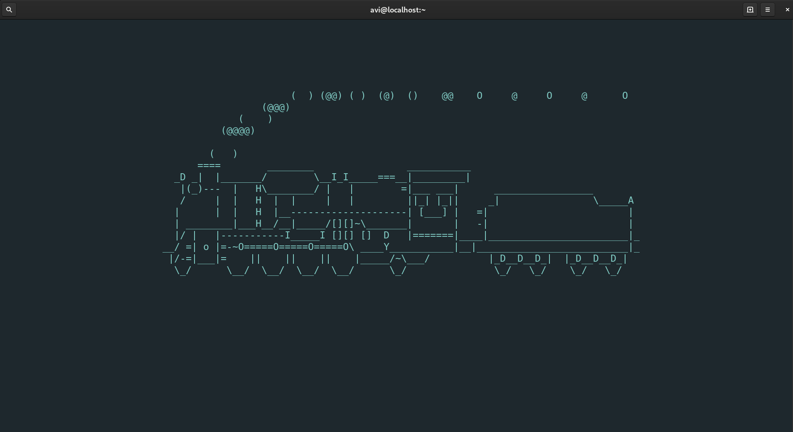

**`QUICK BRIEF`** 🔹 Linux!!! So this article is to set your mood for learning linux terminal commands. Here we have some funny linux commands to play with. let's get into play ground.

> This is one of article on linux terminal series.


## Why does one even bother to learn linux commands?

You have graphical user interface with mouse. Perfect! But consider a scenario where you have to access remote computers without GUI. You get it. Linux Web Servers which are stripped of GUI (unnecessary) for the sake of performance.

Yea! It's obviously true that we are given web browser interfaces (cPanel or Plesk) to access web server resources (database, email, etc); but sometimes you need ful control over your resources. This is where we need the power of linux commands. sounds interesting? 🤔

> If you have not setup any linux distribution yet. Here is [online playground](https://bellard.org/jslinux/vm.html?cpu=riscv64&url=fedora29-riscv-2.cfg&mem=256) (terminal). You might have other alternative. 

## Fun part begins here

### 1. cowsay
First, have somebody to speak and think on behalf of you. `cowsay` generates ascii picture of a cow with a desired message. **Let's install it.**

On debian based system
```bash
$ sudo apt install cowsay
```
<br />

On redhat/fedora
```bash
$ sudo dnf install cowsay
```
<br />

Let's call the speaker.

```bash
$ cowsay "I am on your behalf."
< I am on your behalf. >
 ----------------------
        \   ^__^
         \  (oo)\_______
            (__)\       )\/\
                ||----w |
                ||     ||

```

<br />

You can even call **tux** instead of cow.

```bash
$ cowsay -f tux "Going other way."
< Going other way >
 -----------------
   \
    \
        .--.
       |o_o |
       |:_/ |
      //   \ \
     (|     | )
    /'\_   _/`\
    \___)=(___/

```

<br />

Your beast can think also. so try `$ cowthink "Busy ruminating!"`

> On running linux desktop you can have GUI cowsay `xcowsay`.<br />
> You can install xcowsay just as you did above. 

### 2. fortune

Let's get some fate. `fortune` is a program that displays a pseudorandom message from a database of quotations. **Let's get it.**

On debian based system
```bash
$ sudo apt install fortune
```
<br />

On redhat/fedora
```bash
$ sudo dnf install fortune-mod
```
<br />

> You can also try [Motivate](https://github.com/mubaris/motivate) as an alternative to fortune.

Let's see whats your fortune.

```bash
$ fortune 
The cow is nothing but a machine which makes grass fit for us people to eat.
	--- John McNulty

```

<br />
Let your beast say your fortune.


```bash
$ fortune | cowsay
 ________________________________________
/ You will inherit some money or a small \
\ piece of land.                         /
 ----------------------------------------
        \   ^__^
         \  (oo)\_______
            (__)\       )\/\
                ||----w |
                ||     ||

```
<br />

> Above, vertical bar `|` passes the output of `fortune` to `cowsay` as input.
> Thats all for now!

Or even your beast can think of your fortune.

```bash
$ fortune | cowthink
( Always borrow money from a pessimist; )
( he doesn't expect to be paid back.    )
 ---------------------------------------
        o   ^__^
         o  (oo)\_______
            (__)\       )\/\
                ||----w |
                ||     ||

```
<br />

> You can call `xcowsay` or `xcowthink` to say or think your fortune. <br />

It's wonderful, isn't it?

### 3. figlet

So you decided to have a banner along the beast. `figlet` is a program that creates a banner out of your text.

On debian based system
```bash
$ sudo apt install figlet
```
<br />

On redhat/fedora
```bash
$ sudo dnf install figlet
```
<br />

You and the beast looks excited to have your banner. Let's check your fortune.

```bash
$ figlet "Codanv"
 / ___|___   __| | __ _ _ ____   __
| |   / _ \ / _` |/ _` | '_ \ \ / /
| |__| (_) | (_| | (_| | | | \ V / 
 \____\___/ \__,_|\__,_|_| |_|\_/  

```
<br />

"So can I pass my fortune to banner?" -- Yes! of course.

```bash
$ fortune | figlet 
    __     
   / /_/\__
  / /\    /
 / / /_  _\
/_/    \/  
           
             ____  _                           _    _         _        
 __/\__     |  _ \| | ___  __ _ ___  ___   ___| | _(_)_ __   | |_ ___  
 \    /     | |_) | |/ _ \/ _` / __|/ _ \ / __| |/ / | '_ \  | __/ _ \ 
 /_  _\     |  __/| |  __/ (_| \__ \  __/ \__ \   <| | |_) | | || (_) |
   \/       |_|   |_|\___|\__,_|___/\___| |___/_|\_\_| .__/   \__\___/ 
                                                     |_|               
 _   _            _           _   _                           __ 
| |_| |__   ___  | |__   ___ | |_| |_ ___  _ __ ___     ___  / _|
| __| '_ \ / _ \ | '_ \ / _ \| __| __/ _ \| '_ ` _ \   / _ \| |_ 
| |_| | | |  __/ | |_) | (_) | |_| || (_) | | | | | | | (_) |  _|
 \__|_| |_|\___| |_.__/ \___/ \__|\__\___/|_| |_| |_|  \___/|_|  
                                                                 
 _   _     _        __ _ _        _  __                             _       
| |_| |__ (_)___   / _(_) | ___  (_)/ _|  _   _  ___  _   _    __ _| |_ ___ 
| __| '_ \| / __| | |_| | |/ _ \ | | |_  | | | |/ _ \| | | |  / _` | __/ _ \
| |_| | | | \__ \ |  _| | |  __/ | |  _| | |_| | (_) | |_| | | (_| | ||  __/
 \__|_| |_|_|___/ |_| |_|_|\___| |_|_|    \__, |\___/ \__,_|  \__,_|\__\___|
                                          |___/                             
 _                  _                               _   _       
| |_   _ _ __   ___| |__    _ __ ___  ___ ___ _ __ | |_| |_   _ 
| | | | | '_ \ / __| '_ \  | '__/ _ \/ __/ _ \ '_ \| __| | | | |
| | |_| | | | | (__| | | | | | |  __/ (_|  __/ | | | |_| | |_| |
|_|\__,_|_| |_|\___|_| |_| |_|  \___|\___\___|_| |_|\__|_|\__, |
                                                          |___/ 
                                                      _    _             
 __/\__                                              / \  | | __ _ _ __  
 \    /                              _____ _____    / _ \ | |/ _` | '_ \ 
 /_  _\                             |_____|_____|  / ___ \| | (_| | | | |
   \/                                             /_/   \_\_|\__,_|_| |_|
                                                                         
          __
 __/\__  / /
 \    / / / 
 /_  _\/ /  
   \/ /_/   
            
                 __                       _     _                  
                / _|_ __ ___  _ __ ___   | |   (_)_ __  _   ___  __
  _____ _____  | |_| '__/ _ \| '_ ` _ \  | |   | | '_ \| | | \ \/ /
 |_____|_____| |  _| | | (_) | | | | | | | |___| | | | | |_| |>  < 
               |_| |_|  \___/|_| |_| |_| |_____|_|_| |_|\__,_/_/\_\
                                                                   
 _                        _                       ____    _  ___  _       _ 
| | _____ _ __ _ __   ___| |  _ __  _ __ ___     |___ \  / |/ _ \/ |     / |
| |/ / _ \ '__| '_ \ / _ \ | | '_ \| '__/ _ \_____ __) | | | (_) | |_____| |
|   <  __/ |  | | | |  __/ | | |_) | | |  __/_____/ __/ _| |\__, | |_____| |
|_|\_\___|_|  |_| |_|\___|_| | .__/|_|  \___|    |_____(_)_(_)/_/|_|     |_|
                             |_|                                            

```

<br />

Incredibly yours! 🤣

> Programs like `banner` and `toilet` can also serve the purpose.

### 4. sl

👂 What? You need a Steam Locomotive Engine right in your terminal. 
No worry! **Let's get into it.**

On debian based system
```bash
$ sudo apt install sl
```
<br />

On redhat/fedora
```bash
$ sudo dnf install sl
```
<br />

> It humourously busts your typo habbit of `ls`

Let's dive into it.

```bash
$ sl
```


Note: sl draws moving engine unlike above image.

### 5. espeak

So you want to speak your fortune yourself. Alright! **Here we go!**

`espeak` makes your terminal speak. make sure you have turn on the speakers.

On debian based system
```bash
$ sudo apt install espeak
```
<br />

On redhat/fedora
```bash
$ sudo dnf install espeak
```
<br />

Test your fate!
```bash
$ espeak "Yea! It's my tern."
```
<br />

"I feel like the master! 😇" -- Yes you are.

### 6. cmatrix

"I wonder if you could make falling characters like [The Matrix](https://en.wikipedia.org/wiki/The_Matrix) movie." <br /> -- Why not. **Just do it.**

On debian based system
```bash
$ sudo apt install cmatrix
```
<br />

On redhat/fedora
```bash
$ sudo dnf install cmatrix
```
<br />

Here you are.

```bash
$ cmatrix
```


> Press `ctrl + c` to exit

### 7. aafire

"So I can set my terminal on fire." -- You are kidding.

A text animation of a fire.


On debian based system
```bash
$ sudo apt install libaa-bin
```
<br />

On redhat/fedora
```bash
$ sudo dnf install libaa-bin
```
<br />

```bash
$ aafire
```


### 8. yes

"I need someone to say repeatedly until i interrupt." -- Yes! we have `yes` for this. Don't get confused. **See in action.**

`yes` generates a specified string or 'y' (if no string specified) repeatedly until killed (`ctrl + c`).

👏

```bash
$ yes "Run! You have to reach nowhere."
Run! You have to reach nowhere.
Run! You have to reach nowhere.
Run! You have to reach nowhere.
Run! You have to reach nowhere.
Run! You have to reach nowhere.
Run! You have to reach nowhere.
Run! You have to reach nowhere.
^C
```

<br />

> `Pre-installed commands have no installation instructions.` 

<br />

### 9. telnet 


"I wonder if you could show me star wars like experience right here. What the heck it is!" -- Hold on! Exactly what I wanted to show you. 😊 

> Telnet is an application protocol used on the Internet or local area network 
> to provide a bidirectional interactive text-oriented communication facility  > using a virtual terminal connection.

Here we go. Presenting the `Star Wars` ASCII movie.

```bash
$ telnet towel.blinkenlights.nl
                                      /~\                           
                                     |oo )                          
                                     _\=/_                          
                     ___            /  _  \                         
                    / ()\          //|/.\|\\                        
                  _|_____|_        \\ \_/  ||                       
                | | === | |        \|\ /| ||                       
                |_|  O  |_|        # _ _/ #                        
                  ||  O  ||          | | |                          
                  ||__*__||          | | |                          
                |~ \___/ ~|         []|[]                          
                /=\ /=\ /=\         | | |                          
________________[_]_[_]_[_]________/_]_[_\_________________________
```
<br />

continue watching...🕺

"I am unable to exit the theatre." -- Okay! `ctr + ]` brings you to `telnet` prompt and `quit` to your terminal.

### 10. oneko

"What next?" -- I can make you see Jerry of `Tom and Jerry` duo. 

The program `oneko` creates a cute cat chasing around your mouse cursor.

On debian based system
```bash
$ sudo apt install oneko
```
<br />

On redhat/fedora
```bash
$ sudo dnf install oneko
```
<br />

Be silent! mouse ahead 🤫

```bash
$ oneko
```


### 11. lolcat

"Let's see my fortune with cowsay in multiple colors. 🤗" -- Great! You just developved a sence of curiosity. **Let's get started!**

The command `lolcat` shows text in multiple colors.
 
On debian based system
```bash
$ sudo apt install lolcat
```
<br />

On redhat/fedora
```bash
$ sudo dnf install lolcat
```
<br />

Let's get it into action. 😊
```bash
$ fortune | cowsay | lolcat
```


### 12. rev

"So I want to reverse my bad fortune." -- You can!

The program `rev` reverses lines characterwise.

```bash
$ fortune | rev
".os uoy dlot I" ,yas ot gniog ton m'I 
```

Now, I'm excited to do some mathematics.
 
### 13. factor

"Factors! Let me check my own." -- Of course, with your attitude 🤔

Print the prime factors of each specified integer NUMBER.  If none are specified on the command line, read them from standard input.

```bash
$ factor 135
135: 3 3 3 5
$ factor 455 | cowsay -f dragon
< 455: 5 7 13 >
 -------------
      \                    / \  //\
       \    |\___/|      /   \//  \\
            /0  0  \__  /    //  | \ \    
           /     /  \/_/    //   |  \  \  
           @_^_@'/   \/_   //    |   \   \ 
           //_^_/     \/_ //     |    \    \
        ( //) |        \///      |     \     \
      ( / /) _|_ /   )  //       |      \     _\
    ( // /) '/,_ _ _/  ( ; -.    |    _ _\.-~        .-~~~^-.
  (( / / )) ,-{        _      `-.|.-~-.           .~         `.
 (( // / ))  '/\      /                 ~-. _ .-~      .-~^-.  \
 (( /// ))      `.   {            }                   /      \  \
  (( / ))     .----~-.\        \-'                 .~         \  `. \^-.
             ///.----..>        \             _ -~             `.  ^-`  ^-_
               ///-._ _ _ _ _ _ _}^ - - - - ~                     ~-- ,.-~
                                                                  /.-~
```

<br />

Great evolvement. Kudos!

We have had good start so far. 👍  

> If you stuck while running any command just kill it `ctrl + c`

Thats all for the first article on Linux terminal series! 

"🤗 You just set the mood. Hum! Your next article covers [The Essentials of Linux Terminals](/posts/the-essentials-of-linux-terminal)." -- Thank You! You got the essence.

You are awesome! Really It's for you.

<button style={{boxShadow: `0.2rem 0.2rem 0.5rem #000000`}} onClick={() => alert(`You have just started linux journey! 😊`)}>Hold dear 💜</button>

