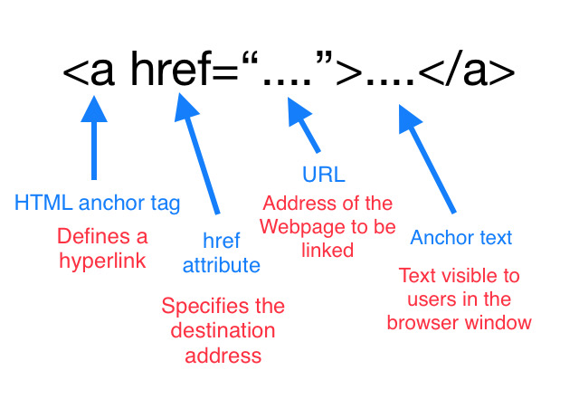

**`QUICK SUMMERY`** 🔹 Hyperlinks are what allow web pages to connect to other web pages without the need to know the [URL](/url-structure-in-brief) for every page on the [web](/world-wide-web-and-its-inception). Simple!😄 

> This is one of article on [internet series](/categories/internet).

A hyperlink (link) is a text string, icon or graphic that references (ties) to another file via a [URL](/url-structure-in-brief) that the user can follow by clicking or tapping. It allows easy jumping from one document to another.  The [web](/world-wide-web-and-its-inception) is comprised of hyperlinks linking trillions of files to one another. 

> URLs already made things easier, but it's hard to type a long URL whenever you want to access a document. This is where hyperlinks came in to the picture. Links can correlate any text string with a URL, such that the user can instantly reach the target document by activating the link.

### Types of links

**Internal link**

A link between two webpages, where both webpages belong to the same website.

**External link**

A link from our webpage to someone else's webpage.The Web consists of a network of webpages.

**Incoming links**
    
A link from someone else's webpage to your site. It's the opposite of an external link. Note that you don't have to link back when someone links to your site.

### Links and Search Engines

Every time search engines crawl a webpage, they index the website by following the links available on the webpage. They also use the link's visible text to determine which search queries are appropriate for reaching the target webpage.

> A program that traverses the hypertext, following each hyperlink and gathering all the retrieved documents is known as a Web spider or crawler.

**How search engines determine a site's rank in terms of hyperlink?**

* A link's visible text influences which search queries will find a given URL.
* The more incoming links a webpage can boast of, the higher it ranks in search results.
* External links influence the search ranking both of source and target webpages.

> SEO (search engine optimization) is the study of how to make websites rank highly in search results. 

It is also possible to create a hyperlink to a location on the same page. A link may also open a new tab and keep the current window open as a background or parent tab.

> Hyperlinks are not exclusive to [web browsers](/understanding-web-browser-and-its-basic-architecture). Many programs (PDFs or other documents) and even operating systems also use hyperlinks.

Sounds good start! This brings us to the end of this article you can explore more articles on internet [here](/categories/internet).

<button style={{boxShadow: `0.2rem 0.2rem 0.5rem #000000`}} onClick={() => alert(`A link decreases a url overhead. 😊`)}>Take away 👆</button>
 