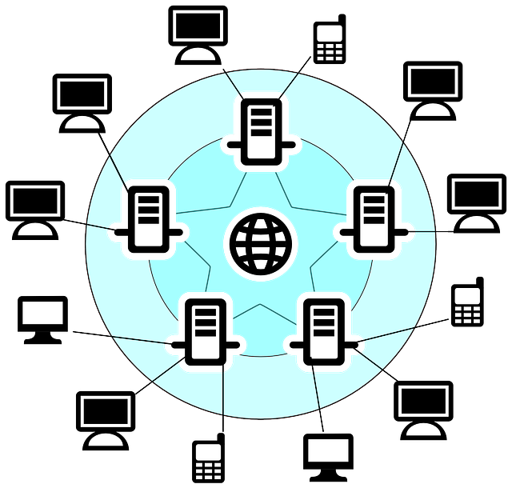

**`QUICK SUMMERY`** 🔹 Every device connected to a network needs a unique identifier so that other devices know how to reach it. In the world of TCP/IP networking, that identifier is the Internet Protocol address. 😄

> This is one of article on internet series.

**Internet Protocol**(IP) address is an identifying number for network hardware connected to a network. Having an IP address allows a device to communicate with other devices over an IP-based network like the internet.

> When www.codanv.com is entered into a browser, your request to load that page is sent to DNS servers that look up the hostname of www.codanv.com to find its corresponding IP address. Basically the computer has no clue what are you looking for.

**IPv4 and IPv6**

IPv4 displays addresses as a 32-bit numerical number written in decimal format, for example, 207.241.148.80 or 192.168.1.1. Because there are trillions of possible IPv6 addresses, they must be written in hexadecimal to display them, for example, 3ffe:1900:4545:3:200:f8ff:fe21:67cf.

> IPv6 uses a 128-bit address instead of the 32-bit address of IPv4.

**Different Types of IP Addresses**

All IP addresses are made up of numbers or letters. There are private IP addresses, public IP addresses, static IP addresses, and dynamic IP addresses. 

Each type of IP address can be an IPv4 address or an IPv6 address.

**Private IP Address:** These are used inside a network, for example, a home network that is used by tablets, Wi-Fi cameras, wireless printers, and desktop PCs. These types of IP addresses provide a way for devices to communicate with a router and the other devices on the private home network.
    
**Public IP Address:** These are used on the outside of a network and are assigned by an ISP. It's the main address that a home or business network uses to communicate with the rest of the networked devices around the world (for example, the internet). It provides a way for the devices in a home, for example, to reach an ISP, and therefore the outside world, allowing the devices to access websites and communicate directly with other computers and servers around the world.

Both private IP addresses and public IP addresses are either dynamic or static, which means that, respectively, they either change or they don't.

An IP address that is assigned by a DHCP server is a dynamic IP address. If a device doesn't have DHCP enabled or doesn't support DHCP, then the IP address must be assigned manually, in which case it's called a static IP address.

**A device’s IP address actually consists of two separate parts:**

**Network ID:** The network ID is a part of the IP address starting from the left that identifies the specific network on which the device is located. On a typical home network, where a device has the IP address 192.168.1.34, the 192.168.1 part of the address will be the network ID. It’s custom to fill in the missing final part with a zero, so we might say that the network ID of the device is 192.168.1.0.
    
**Host ID:** The host ID is the part of the IP address not taken up by the network ID. It identifies a specific device (in the TCP/IP world, we call devices “hosts”) on that network. Continuing our example of the IP address 192.168.1.34, the host ID would be 34—the host’s unique ID on the 192.168.1.0 network.

On your home network, then, you might see several devices with IP address like 192.168.1.1, 192.168.1.2, 192.168.1.40, and 192.168.1.54. All of these are unique devices (with host IDs 1, 2, 40, and 54 in this case) on the same network (with the network ID 192.168.1.0).

To picture all this a little better, let’s turn to an analogy. It’s pretty similar to how street addresses work within a city. Take an address like Seven Street. The street name is like the network ID, and the house number is like the host ID. Within a city, no two streets will be named the same, just like no two network IDs on the same network will be named the same. On a particular street, every house number is unique, just like all host iDs within a particular network ID are unique.

**The Subnet Mask**

So, how does your device determine which part of the IP address is the network ID and which part the host ID? For that, they use a second number that you’ll always see in association with an IP address. That number is called the subnet mask.

On most simple networks (like the ones in homes or small businesses), you’ll see subnet masks like 255.255.255.0, where all four numbers are either 255 or 0. The position of the changes from 255 to 0 indicate the division between the network and host ID. The 255s “mask out” the network ID from the equation.

Note: The basic subnet masks we’re describing here are known as default subnet masks. Things get more complicated than this on bigger networks. People often use custom subnet masks (where the position of the break between zeros and ones shifts within an octet) to create multiple subnets on the same network.

**The Default Gateway Address**

In addition to the IP address itself and the associated subnet mask, you’ll also see a default gateway address listed along with IP addressing information. Depending on the platform you’re using, this address might be called something different. It’s sometimes called the “router,” “router address,” default route,” or just “gateway.” These are all the same thing. It’s the default IP address to which a device sends network data when that data is intended to go to a different network (one with a different network ID) than the one the device is on.

The simplest example of this is found in a typical home network.

If you have a home network with multiple devices, you likely have a router that’s connected to the internet through a modem. That router might be a separate device, or it might be part of a modem/router combo unit supplied by your internet provider. The router sits between the computers and devices on your network and the more public-facing devices on the internet, passing (or routing) traffic back and forth.

Say you fire up your browser and head to www.codanv.com. Your computer sends a request to our site’s IP address. Since our servers are on the internet rather than on your home network, that traffic is sent from your  PC to your router (the gateway), and your router forwards the request on to our server. The server sends the right information back to your router, which then routes the information back to the device that requested it, and you see our site pop up in your browser.

Typically, routers are configured by default to have their private IP address (their address on the local network) as the first host ID. So, for example, on a home network that uses 192.168.1.0 for a network ID, the router is usually going to be 192.168.1.1. Of course, like most things, you can configure that to be something different if you want.

There’s one final piece of information you’ll see assigned alongside a device’s IP address, subnet mask, and default gateway address: the addresses of one or two default Domain Name System (DNS) servers. Humans work much better with names than numerical addresses. 

**DNS** works kind of like a phone book, looking up human-readable things like website names, and converting those to IP addresses. DNS does this by storing all that information on a system of linked DNS servers across the internet. Your devices need to know the addresses of DNS servers to which to send their queries.

On a typical small or home network, the DNS server IP addresses are often the same as the default gateway address. Devices send their DNS queries to your router, which then forwards the requests on to whatever DNS servers the router is configured to use. By default, these are usually whatever DNS servers your ISP provides, but you can change those to use different DNS servers if you want. Sometimes, you might have better success using DNS servers provided by third parties, like Google or OpenDNS.

**Difference Between IPv4 and IPv6**

You also may have noticed while browsing through settings a different type of IP address, called an IPv6 address. The types of IP addresses we’ve talked about so far are addresses used by IP version 4 (IPv4)—a protocol developed in the late 70s. They use the 32 binary bits we talked about (in four octets) to provide a total of 4.29 billion possible unique addresses. While that sounds like a lot, all the publicly available addresses were long ago assigned to businesses. Many of them are unused, but they are assigned and unavailable for general use.

Unlike the dotted decimal notation used in IPv4, IPv6 addresses are expressed as eight number groups, divided by colons. Each group has four hexadecimal digits that represents 16 binary digits (so, it’s referred to as a hextet). A typical IPv6 address might look something like this:

2601:7c1:100:ef69:b5ed:ed57:dbc0:2c1e

The thing is, the shortage of IPv4 addresses that caused all the concern ended up being mitigated to a large extent by the increased use of private IP addresses behind routers. More and more people created their own private networks, using those private IP addresses that aren’t exposed publicly.

So, even though IPv6 is still a major player and that transition will still happen, it never happened as fully as predicted—at least not yet. If you’re interested in learning more, check out this history and timeline of IPv6.

**How Does a Device Get Its IP Address?**

Now that you know the basics of how IP addresses work, let’s talk about how devices get their IP addresses in the first place. There are really two types of IP assignments: dynamic and static.

A dynamic IP address is assigned automatically when a device connects to a network. The vast majority of networks today (including your home network) use something called Dynamic Host Configuration Protocol (DHCP) to make this happen. DHCP is built into your router. When a device connects to the network, it sends out a broadcast message requesting an IP address. DHCP intercepts this message, and then assigns an IP address to that device from a pool of available IP addresses.

There are certain private IP address ranges  routers will use for this purpose. Which is used depends on who made your router, or how you have set things up yourself. Those private IP ranges include:

**10.0.0.0 – 10.255.255.255:** If you’re a Comcast/Xfinity customer, the router provided by your ISP assigns addresses in this range. Some other ISPs also use these addresses on their routers, as does Apple on their AirPort routers.
    
**192.168.0.0 – 192.168.255.255:** Most commercial routers are set up to assign IP addresses in this range. For example, most Linksys routers use the 192.168.1.0 network, while D-Link and Netgear both use the 198.168.0.0 range
    
**172.16.0.0 – 172.16.255.255:** This range is rarely used by any commercial vendors by default.
    
**169.254.0.0 – 169.254.255.255:** This is a special range used by a protocol named Automatic Private IP Addressing. If your computer (or other device) is set up to retrieve its IP address automatically, but cannot find a DHCP server, it assigns itself an address in this range. If you see one of these addresses, it tells you that your device could not reach the DHCP server when it came time to get an IP address, and you may have a networking issue or trouble with your router.

**To Find a Public IP Address:**

There are several ways to find a router's public IP address, but sites like IP Chicken, WhatsMyIP.org, WhatIsMyIPAddress.com, or icanhazip.com make this easy. These sites work on any network-connected devic that supports a web browser.

**To Find a Private IP Address:**

In **Windows**, find your device's local IP address using the Command Prompt and the `ipconfig` command.

**To find a private IP address on other operating systems:**

**Linux:** Launch a terminal window and enter the command `hostname -I`, `ifconfig`, or `ip addr show`.

**MacOS:** Use the command ifconfig to find the local IP address.
    
**iOS:** iPhone, iPad, and iPod touch devices show their private IP address through the Settings app in the Wi-Fi menu. To see it, tap the small "i" button next to the network it's connected to.

**Android:** Find the local IP address of an Android device through Settings > Network & internet > Wi-Fi, or depending on your Android version, Settings > Wi-Fi or Settings > Wireless Controls > Wi-Fi settings. Tap the network you're on to see a new window that shows network information that includes the private IP address. Expand the Advanced area of the network details page to see the private IP address.
