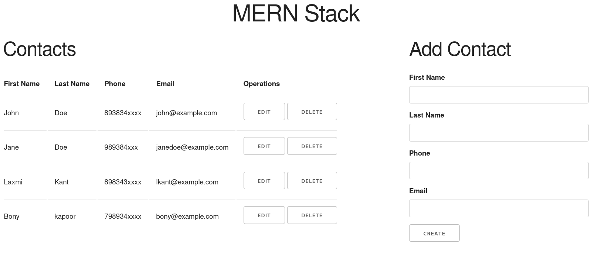

Building a basic contact web application using MongoDB, Express, React and Node (MERN Stack). Here we'll create RESTful api for CRUD operations to mongodb server and user interface using React.

> [Part1: Back-end/server-side (Express/Node/Mongodb)](/posts/mern-crud-example-part1)<br />
> [Part2: Front-end/client-side (React)](/posts/mern-crud-example-part2)

## Back-end/server-side (Express/Node/Mongodb)


In the [first part]((/posts/mern-crud-example-part1)) of the tutorial we are going to create back-end for our basic contact web application.

*At the end of [part2](/posts/mern-crud-example-part2) we'll have source code of the project.*


### Prerequisites

[node.js](https://nodejs.org/en/download/)

[MongoDB server](https://www.mongodb.com/download-center/community)

### Initiating the project

Create an empty directory:

```bash
$ mkdir mern-stack-contact-app
```

Go to the created directory

```bash
$ cd mern-stack-contact-app
```

Finally, Initialize the project

```bash
$ npm init -y
```

This will create a `package.json` file in our root of the project directory. It holds config and dependency list of our project.

Install the dependencies 

```bash
$ npm install express body-parser cors mongodb concurrently
```

- express ~ web framework of nodejs.
- body-parser ~ a middleware to parse form data (post, put, delete, etc).
- cors ~ this middleware enables our application to be requested from another domain.
- mongodb ~ this is a mongodb driver for mongodb database server
- concurrently ~ to keep starting front-end and back-end simultaneously

Install `nodemon` utility to automatically restart the server (as developer dependency)

```bash
$ npm install -D nodemon
```

Before we start to code 

In `package.json` file 

Change `main` property's value from `"index.js"` to  `"server.js"`

and add some scripts to start the server in `"scripts"` property

So your `package.json` looks like the following


**package.json**
```json
{
  "name": "mern-stack-contact-app",
  "version": "1.0.0",
  "description": "",
  "main": "server.js",
  "scripts": {
    "test": "echo \"Error: no test specified\" && exit 1",
    "server": "node server.js",
    "client": "npm start --prefix client",
    "start": "concurrently \"npm run server\" \"npm run client\"",
    "devserver": "nodemon server.js"
  },
  "keywords": [],
  "author": "",
  "license": "ISC",
  "dependencies": {
    "body-parser": "^1.19.0",
    "cors": "^2.8.5",
    "express": "^4.17.1",
    "mongodb": "^3.5.8"
  },
  "devDependencies": {
    "nodemon": "^2.0.4"
  }
}
```

create `server.js` file with following code in the root of `mern-stack-contact-app` project directory

**server.js**
```javascript {numberLines: true}{3, 4-6}
const express = require("express");
const cors = require("cors");
const bodyParser = require("body-parser");

const MongoClient = require("mongodb").MongoClient;
const ObjectID = require("mongodb").ObjectID;

const mongoURI = "mongodb://localhost:27017/";
var db;

MongoClient.connect(mongoURI, { useUnifiedTopology: true }, (err, dbClient) => {
  if (err) throw err;
  db = dbClient.db("contact-database");
  console.log("connected to mongodb server");
});

const app = express();
app.use(bodyParser.json());
app.use(cors());

// rest of the code -- we'll back

app.listen(3001, () => {
  console.log("server is up and running...");
});
```

Let's run `server.js` (listen the power of nodemon)

```bash
$ npm start devserver
```

```bash
server is up and running...
connected to mongodb server
```
**Cool :)**

So, we have so far
- connected to local mongodb database server 
- used `body-parser` and `cors` middleware application wide 

Server is up and running...

Okay! Let's create some HTTP endpoints (RESTful api for CRUD Operations) to 
 
- **Create** ~ creating contact record by sending data using HTTP POST request
- **Read** ~ retrieve the contact list using HTTP GET request
- **Update** ~ updating an existing contact in the database by sending HTTP PUT request
- **Delete** ~ delete contact by sending HTTP DELETE request

*Let's see snippets for CRUD Operations, Don't worry, we'll add them in server.js later.*

**To Read Contact**
```js
app.get("/contacts", (req, res) => {
  db.collection("contacts")
    .find({})
    .toArray((err, contacts) => {
      if (err) throw err;
      res.send(contacts);
    });
});
```

**To Create Contact**
```js
app.post("/contacts/create", (req, res) => {
  db.collection("contacts").insertOne(req.body, (err) => {
    if (err) throw err;
    console.log("contact created");
    res.end();
  });
});
```

**To Update Contact**
```js
app.put("/contacts/update", (req, res) => {
  const { _id, ...rest } = req.body;
  db.collection("contacts").updateOne(
    { _id: ObjectID(_id) },
    { $set: rest },
    (err) => {
      if (err) throw err;
      console.log("contact updated");
      res.end();
    }
  );
});
```

**To Delete Contact**
```js
app.delete("/contacts/delete", (req, res) => {
  db.collection("contacts").deleteOne(
    { _id: ObjectID(req.body._id) },
    (err) => {
      if (err) throw err;
      console.log("contact deleted");
    }
  );
});
```

So finally we have created RESTful api for basic contact app 

Here is the complete code of `server.js`

**Server.js**
```js
const express = require("express");
const cors = require("cors");
const bodyParser = require("body-parser");

const MongoClient = require("mongodb").MongoClient;
const ObjectID = require("mongodb").ObjectID;

const mongoURI = "mongodb://localhost:27017/";
var db;

MongoClient.connect(mongoURI, { useUnifiedTopology: true }, (err, dbClient) => {
  if (err) throw err;
  db = dbClient.db("contact-database");
  console.log("connected to mongodb server");
});

const app = express();
app.use(bodyParser.json());
app.use(cors());

// read
app.get("/contacts", (req, res) => {
  db.collection("contacts")
    .find({})
    .toArray((err, contacts) => {
      if (err) throw err;
      res.send(contacts);
    });
});

// create
app.post("/contacts/create", (req, res) => {
  db.collection("contacts").insertOne(req.body, (err) => {
    if (err) throw err;
    console.log("contact created");
    res.end();
  });
});

// update
app.put("/contacts/update", (req, res) => {
  const { _id, ...rest } = req.body;
  db.collection("contacts").updateOne(
    { _id: ObjectID(_id) },
    { $set: rest },
    (err) => {
      if (err) throw err;
      console.log("contact updated");
      res.end();
    }
  );
});

//delete
app.delete("/contacts/delete", (req, res) => {
  db.collection("contacts").deleteOne(
    { _id: ObjectID(req.body._id) },
    (err) => {
      if (err) throw err;
      console.log("contact deleted");
    }
  );
});

app.listen(3001, () => {
  console.log("server is up and running...");
});
```

That's all from server-side!

We have contact api, Let's go to front-end [Part2: Front-end/client-side (React)](/posts/mern-crud-example-part2) to complete the party 👍
