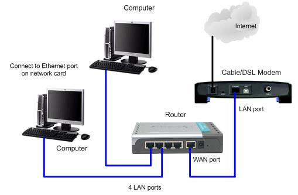

**`QUICK SUMMERY`** 🔹A port is a communication endpoint through which information flows from a program to the computer or over the network. Physical Port? 😊👇 

> This is one of article on [internet series](/categories/internet).



A computer or a program connects to somewhere or something else on the Internet via a port. A Port number is always associated with an IP address of a host and the type of  transport protocol used for communication.

Ports are numbered for consistency and programming. The most commonly used and best known ports are those numbered 0 to 1023 dedicated for Internet use, but they can extend far higher for specialized purposes. Each port set or range is assigned specialized jobs or functions. 

For example, Email received on a local computer generally uses a TCP port 25.  FTP uses port 21, to name only a few port assignments.

**TCP/UDP**

TCP stands for Transmission Control Protocol, and UDP is the abbreviation for User Datagram Protocol. Both relevant to data transmissions on the Internet, but they work very differently.

TCP is considerably more reliable. It is connection-based transmission of data. There must be anchored points between sending location to receiving location, and data A that is sent first will always arrive at the destination prior to data B which was sent second. The only transmission that fails is one that is broken (for instance, if the transmitting point's Internet connection was lost or a receiver's website is down or an email address is no longer valid. The email server is the receiving point that counts there—not the user name.)

UDP is connectionless protocol. Data is sent regardless of the receiving destination's status. Unfortunately, there is no guarantee that the data will ever be received, in what order, or in what condition.

**Port Range Groups**

**0 to 1023** - Well known port numbers. Only special companies like Apple QuickTime, MSN, SQL Services, Gopher Services and other prominent services have these port numbers.

**1024 to 49151** - Registered ports; meaning they can be registered to specific protocols by software corporations.

**49152 to 65536** - Dynamic or private ports; meaning that they can be used by just about anybody.

**Port forwarding**, or **tunneling**, is the behind-the-scenes process of intercepting data traffic headed for a computer's IP/port combination and redirecting it to a different IP and/or port. A program that's running on the destination computer (host) usually causes the redirection, but sometimes it can also be an intermediate hardware component, such as a router, proxy server or firewall.

**Playing with packets**

It all starts with the packets that get created when you send a data request over the Internet.

Normally, a network router will examine the header of an IP packet and send it to a linked and appropriate interface, which in turn sends the data to the destination information that's in the header.

But in port forwarding, the intercepting application (or device) reads the packet header, notes the destination, and then rewrites the header information and sends it to a another computer—one that's different from the one intended. That secondary host destination may be a different IP address using the same port, a different port on the same IP address, or a completely different combination of the two.

**Why port forwarding?**

Port forwarding is an excellent way to preserve public IP addresses. It can protect servers and clients from unwanted access, "hide" the services and servers available on a network, and limit access to and from a network. Port forwarding is transparent to the end user and adds an extra layer of security to networks.

In short, port forwarding is used to keep unwanted traffic off networks. It allows network administrators to use one IP address for all external communications on the Internet while dedicating multiple servers with different IPs and ports to the task internally. Port forwarding is useful for home network users who may wish to run a Web server or gaming server on one network.

The network administrator can set up a single public IP address on the router to translate requests to the proper server on the internal network. By using only one IP address to accomplish multiple tasks—and dropping all traffic that is unrelated to the services provided at the firewall—the administrator can hide from the outside world what services are running on the network.

**A look at port forwarding**

In the simplified example below, IP Address 10.0.0.1 sends a request to 10.0.0.3 on Port 80. An intermediate host—10.0.0.2—intercepts the packets, rewrites the packet headers and sends them on to IP Address 10.0.0.4 on Port 8080:

```
10.0.0.1		-->		10.0.0.2		-->		10.0.0.4 
Makes a request to		 		Actually sends to		 
10.0.0.3:80		 		        10.0.0.4:8080
```		 

The host, 10.0.0.4, responds to the request, sending it to 10.0.0.2. Then 10.0.0.2 rewrites the packet—indicating that the response is from 10.0.0.3—and sends it to 10.0.0.1:

```
10.0.0.4		-->		10.0.0.2		-->		10.0.0.1
 		Sends its response to		 		Forwards the response to		 
 		10.0.0.2:8080		 		        10.0.0.1:80		 
```

As far as 10.0.0.1 is concerned, it has sent a request to 10.0.0.3 on Port 80 and has received a response back from 10.0.0.3 on Port 80. This is not what has happened—the traffic has never actually touched 10.0.0.3. However, because of the way the packets have been rewritten, 10.0.0.1 sees that it has gotten a response from 10.0.0.3.

The perceived destination is always from the perspective of the requesting computer. As it shows in the diagram, even though 10.0.0.4 has become the real-time destination for traffic from 10.0.0.1, the destination for all traffic (as far as the requesting host knows) is 10.0.0.3.

**Port forwarding and proxies**

It probably won't surprise you to learn that Web proxies use a port-forwarding service. Similar to the above home-network example, Web proxy servers use port forwarding to prevent direct contact between clients and the wide-open world of the Internet. When a proxy or VPN receives your online activity (an email sent or a request to see a website), it inspects and rewrites data packets of your transmission before it moves them to and from their Internet destinations.

Each individual computer runs on multiple ports. For instance, when a person opens his or her email, the computer's server will open a port through which new mail will be downloaded through a connection to the email server. Certain ports on an individual's personal computer are open continually, making them a target for any potential hacker who is searching for individuals to victimize. This can lead to one's sensitive and personal information falling into the hands of those who intend on using it for criminal activity. Unfortunately, criminals and computer hackers are always looking for new victims to exploit, and port scanning is one of the ways through which this can be accomplished.

**Port Scanning**

Port Scanning is the name for the technique used to identify open ports and services available on a network host. It is sometimes utilized by security technicians to audit computers for vulnerabilities, however, it is also used by hackers to target victims. It can be used to send requests to connect to the targeted computers, and then keep track of the ports which appear to be opened, or those that respond to the request.

When a criminal targets a house for a burglary, typically the first thing he or she checks is if there is an open window or door through which access to the home can be gained. A Port scan is similar, only the windows and doors are the ports of the individual's personal computer. While a hacker may not decide to "break in" at that moment, he or she will have determined if easy access is available. Many people feel this activity should be illegal, which it is not, however, due to the fact that the potential attacker is merely checking to see if a possible connection could be made, in most areas, it is not considered a crime. However, if repetitive port scans are made, a denial of service can be created.

Hackers typically utilize port scanning because it is an easy way in which they can quickly discover services they can break into. In some cases, hackers can even open the ports themselves in order to access the targeted computer. Hackers also use port scanners to conduct tests for open ports on Personal Computers that are connected to the web.

**Port Sweeping**

Port sweeping is regarded by certain systems experts to be different from port scanning. They point out that port scanning is executed through the searching of a single host for open ports. However, they state that port sweeping is executed through the searching of multiple hosts in order to target just one specific open port. While Port scanning and sweeping have legitimate uses with regard to network management, unfortunately, they are used almost as frequently for the purpose of criminal activity.

**A Serious Threat**

Any time there are open ports on one's personal computer, there is potential for the loss of data, the occurrence of a virus, and at times, even complete system compromise. It is essential for one to protect his or her virtual files, as new security risks concerning personal computers are discovered every day. Computer protection should be the number one priority for those who use personal computers. Port scanning is considered a serious threat to one's PC, as it can occur without producing any outward signs to the owner that anything dangerous is taking place.

The most common challenge a person faces with virtual ports is network security. Internet attackers regularly probe the ports of websites, routers, and any other network gateways. A network firewall greatly helps to guard against these attacks by limiting access to ports based on their number.

**Firewall Protection**

Protection from port scanning is often achieved through the use of a firewall. A firewall monitors incoming and outgoing connections through one's personal computer. One technique used by firewall technology is the opening of all the ports at one time. This action stops port scans from returning any ports. This has worked in many situations in the past, however, most experts agree it is best to have all open ports investigated individually. Another approach is to filter all port scans going to one's computer. An individual can also choose to port scan his or her own system, which enables one to see the personal computer through the eyes of a hacker.

To be most effective, a firewall tends to be overprotective and will sometimes block traffic that a person wanted to allow. Methods for configuring the rules that firewalls use to process traffic—such as port forwarding rules—can be very difficult for non-professionals to manage. 

A port number is a 16-bit unsigned integer, thus ranging from 0 to 65535.

**Common port numbers Number 	Assignment**

* 20 		File Transfer Protocol (FTP) Data Transfer
* 21 		File Transfer Protocol (FTP) Command Control
* 22 		Secure Shell (SSH) Secure Login
* 23 		Telnet remote login service, unencrypted text messages
* 25 		Simple Mail Transfer Protocol (SMTP) E-mail routing
* 53 		Domain Name System (DNS) service
* 67, 68 	Dynamic Host Configuration Protocol (DHCP)
* 80 		Hypertext Transfer Protocol (HTTP) used in the World Wide Web
* 110 	Post Office Protocol (POP3)
* 119 	Network News Transfer Protocol (NNTP)
* 123 	Network Time Protocol (NTP)
* 143 	Internet Message Access Protocol (IMAP) Management of digital mail
* 161 	Simple Network Management Protocol (SNMP)
* 194 	Internet Relay Chat (IRC)
* 443 	HTTP Secure (HTTPS) HTTP over TLS/SSL 

The most important ports on computers are used for networking, for without them, the computer would be completely isolated and unable to communicate outside of itself. 

**Physical Ports**

A port can be either physical or virtual. Physical network ports allow the connection of cables to computers, routers, modems, and other peripheral devices. Ports themselves are physically connected in one way or another to the motherboard.

Several different types of physical ports available on computer network hardware include:

**Ethernet ports:** Square-shaped connection points for Ethernet cables

**USB ports:** Rectangular-shaped connection points for USB cables

**Serial ports:** Round-shaped connection points for serial cables

**Issues With Ports in Computer Networking**

Physical ports can stop functioning for any of several reasons. Causes of port failure include:

* Power surges (for devices physically connected to electric mains)
* Water damage
* Internal failure
* Damage caused by the cable pins (e.g., inserting cables too forcefully, or by attempting to plug the wrong type of cable into a port)

Except for damage to pins, a physical inspection of the port hardware won't find anything obviously wrong. A failure of one port on a multiport device (such as a network router) doesn't affect the functioning of the other ports.

The speed and specification level of a physical port can also not be determined just by physical inspection. Some Ethernet devices, for example, operate at a maximum of 100 Mbps, while others support Gigabit Ethernet, but the physical connector is the same in both cases. Similarly, some USB connectors support version 3.0 while others only support USB 2.x or sometimes even USB 1.x.

Computer ports have numerous functions and connectors of varying designs. Types of computer ports include:

**Serial Ports:** These are most commonly used for connections to mice and modems.

**Parallel Ports:**These are most commonly used for printers.

**Small Computer System Interface (SCSI) Ports:** These are used to connect printers and up to seven total devices, such as hard disks and tape drives, to the same port; they can support higher data transmission speeds than serial or parallel ports.

**Universal Serial Bus (USB) Ports:** As the name implies, these can be used to connect many devices including all previously mentioned plus keyboards, scanners, external hard drives, USB drives (also sometimes called thumb drives or portable USB drives), cameras, iphones and many other peripherals and devices.

Typical serial ports may use a serial RS-232C or an RS-232 connector. A parallel port on a personal computer (PC) may use a Centronics interface with a 25-pin connector.

SCSI ports come in a variety of interface connections; these include:

**Parallel SCSI (SPI):** This port uses a parallel electrical bus configuration.

**Serial Attached SCSI (SAS):** This port uses a serial design with SCSI technology.

**Internet Small Computer System Interface (iSCSI):** This port is not a physical connection at all, but uses TCP/IP to facilitate data transfer over intranets, local area networks (LANs), wide area networks (WANs) or the Internet.

There are also many other interfaces that do not conform to the SCSI standard but use the SCSI command protocol.

USB ports are one of the most common computer ports in use today. They are hot pluggable external connectors with 4 pins (1 for power supply, 2 for data and 1 for a ground connection), measure 4.5 mm by 11.5 mm and come with a maximum length cable of 5 meters. The maximum number of devices that can be connected to a single computer with USB computer ports is 127.

Lots of stuff for the time! this article ends here. you can explore more articles on internet [here](/categories/internet).

<button style={{boxShadow: `0.2rem 0.2rem 0.5rem #000000`}} onClick={() => alert(`Logical or physical endpoint 😊`)}>Take away 👆</button>
