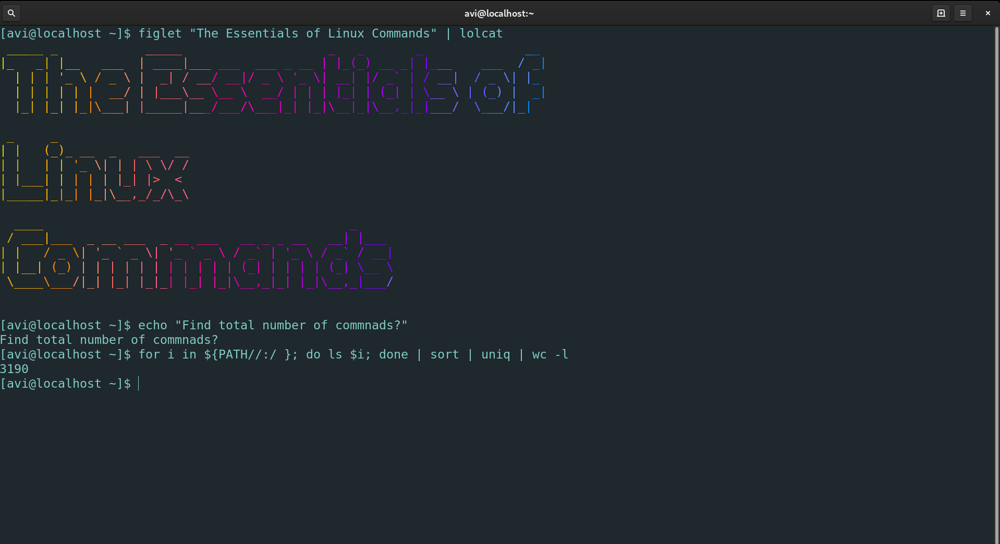

**`QUICK BRIEF`** 🔹 Usability!!! Here we have examples demonstrating the usages of basic linux commands. By the end of this article, you should be able to teach your friends how to operate their linux machine. I am hopeful.😄   

> This is one of article on linux terminal series.



Every system includes a command line of one sort or another. In the last article we have had [fun part of linux terminal](/fun-part-of-linux-terminal)  where we came across "why does one even bother to learn linux commands?" and set your mood for learning them.

## Command Your Terminal

> ⚡ Linux commands are case-sensitive.

### 1. pwd

**P**rint **w**orking **d**irectory command prints the current working directory.

```bash
$ pwd
/home/avi
```

<br />

### 2. cd

**c**hange **d**irectory command changes the working directory.

```bash
$ pwd
/home/avi
$ cd music
$ pwd
/home/avi/music
```

<br />

**Note**: The directory separator is a forward slash("/"), not the backslash(Windows/DOS systems).

> Here Unix-like systems (Linux) don’t split up the drives instead they have a single unified file system, and individual drives can be attached (“mounted”) to whatever location in the file system makes most sense. The “/” directory, often referred to as the root directory, is the base of that unified file system. From there everything else branches out to form a tree of directories and subdirectories.

You can even change to `/` directory

```bash
$ cd /
$ pwd
/
```

<br />

or `~` to back your home directory

```bash
$ cd ~
$ pwd
/home/avi
```

<br />

> There is also a directory `"root"` (as word) for superuser's home which is different from root `/` directory. Actually, `"root"` directory is an immediate subdirectory of `/` root directory.

So you can try and observe.

```bash
$ cd /
$ cd root
bash: cd: root: Permission denied
$ cd home
$ pwd
/home
$ cd avi
$ pwd
/home/avi
$ cd music
$ pwd
/home/avi/music
```

<br />

To go up to the parent directory, we have special symbol of two dots `..` 

```bash
$ pwd
/home/avi/music
$ cd ..
/home/avi
$ cd ..
/home
```

<br />

From your home directory, try `$ cd ../..` and then `$ cd`

Notice the space between `cd` and `..` 

**Relative Path**

Most of the examples we have looked at so far use relative paths. That is, the place you end up at depends on your current working directory. 

**Absolute Path**

No matter what your current working directory is, they will have the same effect. We have already used absolute path atleast two tiems - 

* While running `cd` on its own to go straight to your home directory. 
* When we used `cd /` to switch to the root directory.

In fact any path that starts with a forward slash is an absolute path.

The `whoami` command will tell you your username. which you can replace to form absolute path -

```bash
$ whoami
avi
```

<br />

/home/`your-user-name`/Desktop

/home/`avi`/Documents

```bash
$ cd /
$ pwd
/
$ cd /home/avi/Documents
$ cd /
$ pwd
/
$ cd
$ pwd
/home/avi
```

<br />

`~` is handy shortcut for absolute path.

```bash
$ cd ~
$ pwd
/home/avi
$ cd ~/Desktop
$ pwd
/home/avi/Desktop
```

<br />

### 3. mkdir

`mkdir` command makes directories, if they do not exist.

```bash
$ pwd
/home/avi
$ mkdir linux-basics
$ cd linux-basics
$ pwd
/home/avi/linux-basics
```

<br />

we can even create multiple directories

```bash
$ cd /tmp
$ pwd
/tmp
$ mkdir universe galaxy  
$ cd universe
$ pwd
/tmp/universe
$ cd ..
$ cd galaxy
$ pwd
/tmp/galaxy
```

<br />

What if we want a directory with parent directory which actually doesn't exist

```bash
$ pwd
/tmp
$ mkdir solar-system/earth
mkdir: cannot create directory ‘solar-system/earth’: No such file or directory
```

<br />

We need to use an option or a switch `-p` with `mkdir` which tells the terminal to create parent directory. So options can change the behavior of the command.

```bash
$ mkdir solar-system/earth
$ cd solar-system/earth
$ pwd
/tmp/solar-system/earth
```

<br />

It's good practice to use `'-'` or `'_'` instead of space, nevertheless we can put directory name in double quote or escape the space. Let me show you.

```bash
$ cd /tmp
$ mkdir "Iron Man"
$ mkdir Super\ Man
$ cd Iron\ Man
$ pwd
/tmp/Iron Man
$ cd ..
$ cd "Super Man"
$ pwd
/tmp/Super Man
```

<br />

Or you can even try `$ mkdir -p "outer volt"/"inner volt"` 🦸🏿 

### 4. echo

`echo` displays its arguments back out again. 

```bash
$ echo "Here you are!"
Here you are!
```

<br />

We can easily create small file by combining echo with redirect `>` so that the output of echo is redirected to a file instead of standard output(screen).

```bash
$ cd /tmp/solar-system/earth
$ echo "hey it's a pen to write or dig with." > msg.txt
$ echo "easy to create a file" > msg2.txt 
$ whoami > user.txt
```

> You can also use `touch` command to create a file.

<br />

### 5. ls

`ls` commands lists directory contents

```bash
$ pwd
/tmp/solar-system/earth
$ ls
msg.txt msg2.txt user.txt  
$ mkdir demo
$ ls
demo msg.txt msg2.txt user.txt
```
<br />

We can even redirect the output of ls to a file.

```bash
$ pwd
/tmp/solar-system/earth
$ ls > file-list.txt
$ ls
demo file-list.txt msg.txt msg2.txt user.txt
```

<br />

We can use some switches with `ls` commands

* `-l` for long listing of directory contents
* `-a`  do not ignore entries starting with .

> `man` command prints reference manuals for almost every linux commands.

```bash
$ pwd
/tmp/solar-system/earth
$ ls -l
drwxrwxr-x. 3 avi    avi       1640 Jul 22 17:17  demo
-rw-rw-r--. 1 avi    avi     143309 Jul 22 11:52  file-list.txt
-rw-rw-r--. 1 avi    avi    2386871 Jul 22 11:57  msg.txt
-rw-rw-r--. 1 avi    avi    2386871 Jul 22 11:57  msg2.txt
-rw-rw-r--. 1 avi    avi    2669948 Jul 22 12:26  user.txt
```

<br />

Try `$ man ls` 😄

### 6. cat

`cat` command concatenates files and print on the standard output

So we can view the content of files we have created.

```bash 
$ pwd
/tmp/solar-system/earth
$ cat file-list.txt
demo file-list.txt msg.txt msg2.txt user.txt
$ cat msg.txt
hey it's a pen to write or dig with.
$ cat msg2.txt
easy to create a file
```

<br />

> `tac` command  concatenates and print files in reverse

Let try this

```bash
$ cat msg.txt msg2.txt
hey it's a pen to write or dig with.
easy to create a file
```

<br />

**Wildcard**

 A question mark ("?") can be used to indicate “any single character” within the file name. An asterisk ("*") can be used to indicate “zero or more characters”.

Alternative to `$ cat msg.txt msg2.txt`

```bash
$ cat msg*
hey it's a pen to write or dig with.
easy to create a file
$ cat msg?.*
easy to create a file
``` 

<br />

We can create a combined file using wildcard.

```bash
$ cat msg* > combined.txt
$ cat combined.txt
hey it's a pen to write or dig with.
easy to create a file
```

<br />

Whenever we redirect `>`, The shell clears out the existing file's content before writing on it. Let's see in action.

```bash
$ echo "some text" > filez.txt
$ cat filez.txt
some text
$ echo "text at second line" > filez.txt
$ cat filez.txt
text at second line
```

<br />

In order to append contents, we need to double up the greater than characters `>>`

```bash
$ echo "next line" >> filez.txt
$ echo "one more" >> filez.txt
$ cat filez.txt
text at second line
next line
one more
```

<br />

### 7. mv

`mv` commands move or rename files.

Let's move `combined.txt` file in home directory

```bash
$ mv combined.txt ~
$ cd
$ ls combined.txt
combined.txt
```
<br />

To move `combined.txt` to Desktop directory

```bash
$ cd
$ mv combined.txt ~/Desktop
$ cd Desktop
$ ls combined.txt
combined.txt
```

<br />

Again, `solar-system/*` directory to `/tmp`

```bash
$ cd /tmp
$ mv solar-system/* .
```
<br />

**Note**: Single dot `.` represents current working directory.

We can move multiple files or directories at a time.

`$ mv file1.txt file* directory1 directory2 lastone`

`file1.txt file* directory1 directory2` will be moved to `lastone` directory.

**Rename**

```bash
$ cd /tmp
$ mv solar-system zoom
$ ls zoom
zoom
``` 

<br />

### 8. cp

`cp` commands copy files and directories

```bash
$ cd /tmp/zoom
$ cp combined.txt combined_backup.txt
$ ls combined_backup.txt
combined_backup.txt
``` 

<br />

You can make a `symbolic link` of combined.txt file in your home directory

```bash
$ pwd
/avi/home
$ cp -s /tmp/zoom/combined.txt combined
$ ls combined
lrwxrwxrwx. 1 avi avi 33 Jul 23 10:28 je -> /tmp/zoom/combined.txt
```

<br />

### 9. rm

`rm` command remove files or directories

> Make sure that you don’t accidentally delete anything (in your home folder), use the pwd command to double-check where you are and what actually you want to do.

```bash
$ pwd
/avi/home
$ ls combined
combined
$ rm combined
$ cd /tmp/zoom
$ rm combined.txt msg.txt msg1.txt
```

<br />

We can delete empty directory with `-d` switch.

```bash
$ mkdir /tmp/test23
$ rm -d test23
```

<br />

> `rm -d` is equivalent to `rmdir` command as both remove empty directories.

If you want delete directories and files altogether, switch `-r` is handy (It's also dangerous) and combine switch `-f` to ignore nonexistent files and arguments, never prompt.

```bash
$ rm -rf /tmp/zoom
```

<br />

**A safer option**

The command `$ rmdir -p dir1/dir2/dir3` will first remove `dir3`, then `dir2` then finally `dir1` if they are empty.

**Careful**

`rm` or `rmdir` doesn’t move files to a folder called “trash” (Recycle Bin or similar). Instead it deletes them totally.

### 10. wc

`wc` command print newline, word, and byte counts for each file

```bash
$ echo "first line" > deny.txt
$ echo "second line of text" >> deny.txt
$ echo "third line of the story" >> deny.txt
$ echo "end line" >> deny.txt
$ wc deny.txt
 4 13 64 deny.txt
```
<br />

We can use different switches

* `-l` print the newline counts
* `-w` print the word counts
* `-m` print for character counts
* `-c` print the byte counts
* `-L` print the maximum display width

Let's see in action

```bash
$ wc -l deny.txt
 4 deny.txt
$ wc -w deny.txt
13 deny.txt
$ wc -m deny.txt
 64 deny.txt
$ wc -L deny.txt
23 deny.txt
```
<br />

### Piping

The process of taking the output from one command (STDOUT) and feeding it directly in as the input to another command (STDIN) is called `piping`.

We want to pass the output of `ls ~` to `wc -l`

```bash
$ ls ~ | wc -l
40
```

<br />

Notice the `|` symbol used for piping.

<br />

Try this out 🔥

```bash
$ ls /tmp | uniq | wc -l
```
<br />

**Note**:  `uniq` command reports or omits repeated lines

### 11. man

`man` commnad prints reference manuals or help for your commnads.

```bash
$ man ls
```

<br />

You can press `q` to quit and `h` for help while using `man` command. Explore some commands with their options or switches.

There are many commands out there. You can check the number.

```bash
$ for i in ${PATH//:/ }; do ls $i; done | sort | uniq | wc -l
```

<br />

Stunned! 😯

Use `$ tree` command as bonus. 🖐

Okay! This brings us to the end of this article you can explore more articles on linux [here](/categories/linux).

<button style={{boxShadow: `0.2rem 0.2rem 0.5rem #000000`}} onClick={() => alert(`Are you ready. Your friends are waiting. 😊`)}>Hold dear 💜</button>
