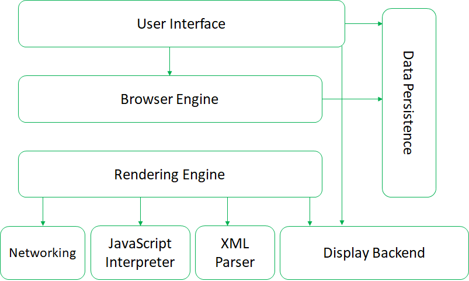

**`QUICK BRIEF`** 🔹 The software suites that can interpret and display HTML Web pages, applications and other content hosted on Web servers. By the help of plug-ins, We can extend browsers' functionalities.😄

> This is one of article on linux terminal series.

## Web browser

A browser is a software used to locate, retrieve and display Web pages and related content on the World Wide Web.  The browser serves as the client and run on a computer that contacts the Web server and requests information. The Web server sends the information back to the Web browser in a client/server model.

The browser can be used to perform tasks such as videoconferencing, to display multimedia information, to design web pages or add anti-phishing filters and other security features by the help of plug-ins. So have extend functionalities!👍

## The main components:

*The User Interface*: is the space where User interacts with the browser. It includes the address bar, back and next buttons, home button, refresh and stop, bookmark option, etc. 

*The Browser Engine*: queries and manipulates the rendering engine according to the inputs from various user interfaces. It serves as a bridge between the User interface and the rendering engine. 

*The Rendering Engine*: is responsible for rendering the requested web page on the browser screen. It interprets the HTML, XML documents and images that are formatted using CSS and generates the layout

> * Gecko: Firefox & other Mozilla browsers
> * EdgeHTML: Microsoft Edge  
> * Blink: Chrome, Opera 15+ 
> * Webkit: Google Chrome (iPhone) & Safari
> * Trident: Internet Explorer

*Networking*: retrieves the URLs using the common internet protocols of HTTP or FTP. It handles all aspects of Internet communication, security and creating cache of retrieved documents to reduce network traffic.

*JavaScript Interpreter*: interprets and executes the javascript code embedded in web pages. The results are sent to the rendering engine for display. If the script is external then first the resource is fetched from the network. Parser keeps on hold until the script is executed.

*UI Backend*: is used for drawing basic widgets like combo boxes and windows. This backend exposes a generic interface that is not platform specific. It underneath uses operating system user interface methods.

*Data Persistence(Storage)*: is a persistence layer. Browsers support storage mechanisms such as localStorage, IndexedDB, WebSQL and FileSystem. It is a small database created on the local drive of the computer where the browser is installed. It manages user data such as cache, cookies, bookmarks and preferences.

> An important thing to note here is that in web browsers such as Google Chrome each tab runs in a separate process(multiple instances of rendering engine).

## Rendering engine basic flow

The networking layer will start sending the contents of the requested documents to the rendering engine in chunks of 8KBs.

The rendering engine parses the chunks of HTML document and convert the elements to DOM nodes in a tree called the “content tree” or the “DOM tree”. It also parses both the external CSS files as well in style elements.

While the DOM tree is being constructed, the browser constructs another tree, the render tree. This tree is of visual elements in the order in which they will be displayed. It is the visual representation of the document. The purpose of this tree is to enable painting the contents in their correct order. Firefox calls the elements in the render tree “frames”. WebKit uses the term renderer or render object.

After the construction of the render tree, it goes through a “layout process” of the render tree. When the renderer is created and added to the tree, it does not have a position and size. The process of calculating these values is called layout or reflow. This means giving each node the exact coordinates where it should appear on the screen. The position of the root renderer is 0,0 and its dimensions are the viewport–the visible part of the browser window. All renderers have a “layout” or “reflow” method, each renderer invokes the layout method of its children that need layout.

The next stage is painting. In the painting stage, the render tree is traversed and the renderer’s “paint()” method is called to display content on the screen. Painting uses the UI backend layer.

The rendering engine always tries to display the contents on the screen as soon as possible for better user experience. It does not wait for the HTML parsing to complete before starting to build and layout the render tree. It parses and displays the content it has received from the network, while rest of the contents stills keeps coming from the network.

> The first web browser was called WorldWideWeb(later `Nexus`) created by Sir Tim Berners-Lee.

Okay! This brings us to the end of this article you can explore more articles on internet [here](/categories/internet).

Reference: https://www.html5rocks.com/en/tutorials/internals/howbrowserswork/#Resources

<button style={{boxShadow: `0.2rem 0.2rem 0.5rem #000000`}} onClick={() => alert(`So you have stated. 😊`)}>Hold dear 💛</button>

