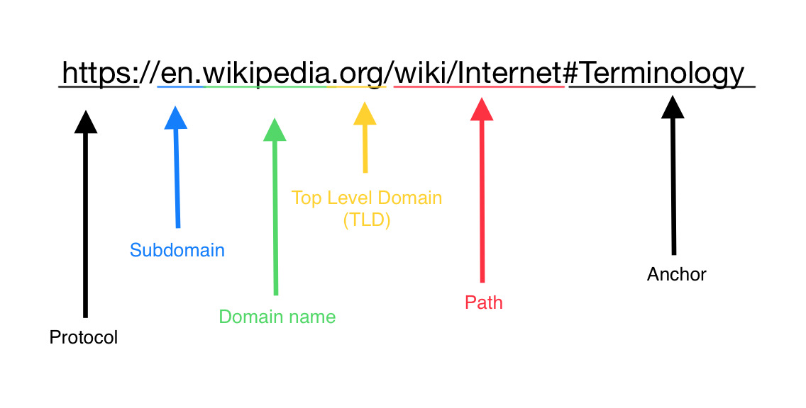

**`QUICK SUMMERY`** 🔹 A mechanism used by [web browsers](/understanding-web-browser-and-its-basic-architecture/) to locate and retrieve  any published content on [the web](/world-wide-web-and-its-inception).😄 

> This is one of article on [internet series](/categories/internet).

*URL* stands for Uniform Resource Locator. A URL is the address of a given unique resource on the Web. Each valid URL should point to a unique resource(an HTML page, a CSS document, an image, etc). The most common exception is a URL may point to a resource that no longer exists or that has moved. 

As the resource represented by the URL and the URL itself are handled by the Web server, it is up to the owner of the web server to carefully manage that resource and its associated URL.😟

URLs occur most commonly to reference web pages (http), but are also used for file transfer (ftp), email (mailto), database access (JDBC), and many other applications.

**Some examples of URLs:**

https://www.codanv.com  
https://www.codanv.com/blogs  
https://www.codanv.com/tags  
https://www.codanv.com/categories/internet 

> Most web browsers display the URL of a web page above the page in an address bar. A typical URL could have the form https://www.codanv.com/tags/webintro 👆  

## A URL is composed of different parts, some mandatory and others optional:

http://www.example.com:80/others/mfile.html?k1=vle1&k2=vle2#SthInTheDoc

`http` is the *protocol*. The first part of the URL indicates which protocol the browser must use. 

> Usually for websites it is the HTTP protocol or its secured version, HTTPS. The Web requires one of these two, but browsers also know how to handle other protocols such as mailto: (to open a mail client) or ftp: to handle file transfer.

`www.example.com` is the *domain* name. It indicates which Web server is being requested. Alternatively, an IP address can be used.

`:80` is the [port](/port-basics-in-computer-networking). It indicates the technical "gate" used to access the resources on the web server. Default port of the HTTP protocol (80 for HTTP and 443 for HTTPS) is omited.

`/others/mfile.html` is the path to the resource on the Web server. It is mostly an abstraction handled by Web servers without any physical reality.

`?k1=vle1&k2=vle2` are extra parameters provided to the Web server. Those parameters are a list of key/value pairs separated with the & symbol. The Web server can use those parameters to do extra stuff before returning the resource. Each Web server has its own rules regarding parameters.

`#SthInTheDoc` is an *anchor* to another part of the resource itself. An anchor represents a sort of "bookmark" inside the resource, giving the browser the directions to show the content located at that "bookmarked" spot. On an HTML document, for example, the browser will scroll to the point where the anchor is defined; on a video or audio document, the browser will try to go to the time the anchor represents. It is worth noting that the part after the #, also known as the fragment identifier, is never sent to the server with the request.

> With Hypertext and HTTP, URL is one of the key concepts of the Web. 

Okay! This brings us to the end of this article you can explore more articles on internet [here](/categories/internet).

<button style={{boxShadow: `0.2rem 0.2rem 0.5rem #000000`}} onClick={() => alert(`A canonical URL is a technical solution for duplicate content. 😊`)}>Hold dear 💜</button>
 