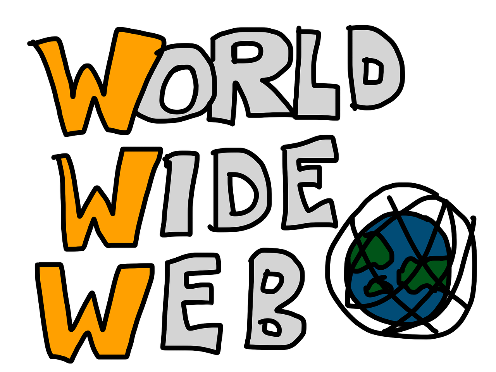

**`QUICK SUMMERY`** 🔹It is the collective name for all the pages, sites, documents, and other media that are served to visitors by web servers and accessed by web browsers. 😄

> This is one of article on internet series.

The Web, or World Wide Web (W3), is basically a system of Internet servers that support specially formatted documents. The documents are formatted in HTML (HyperText Markup Language) that supports links to other documents, as well as graphics, audio, and video files.

Link to other documents means you can jump from one document to another simply by clicking on hot spots 👆. Documents/resources on the web servers have unique URLs.

Not all Internet servers are part of the World Wide Web (Others include email, File Transfer Protocol (FTP), Usenet news groups, and instant messaging services). 

World Wide Web is not synonymous with the Internet. It is an information-sharing model that is built on top of the internet.

It is the collective name for all the pages, sites, documents, and other media that are served to visitors by web servers.

The web consists of digital documents, referred to as web pages, that are viewable through web browser software on devices like smartphones, tablets, and computers. These pages include static content like encyclopedia pages, but also dynamic content like flipkart, eBay sales, stocks, weather, news, and traffic reports. 

Search engines like Google make it easy to filter the billions of web pages now populating the web by locating the articles, videos, and other media you want to find based on your search criteria.

Although the Web does make up a large portion of the Internet, but they are not same. The web is one part of the internet (information superhighway 😊).

You can't have the web without the Internet. 

Both the internet and the web serve unique purposes but work hand in hand to provide information, entertainment, and other services to the public.

Plain and simple, the internet allows access to the World Wide Web. Without it, we have no way of accessing the thousands of websites out there. For most online needs, however, the web is the easiest to use. Each serves an important purpose.

The world wide web opened up the internet to everyone 🙏, not just for scientists.

*1989*

Sir Tim Berners-Lee wrote the original proposal for the world wide web.
His proposal included the three main technologies (HTML, URL and HTTP) that were needed and which remain in use in today.

*1991*

The first website went live at CERN in Europe.
Sir Tim Berners-Lee created the first-ever website. It was hosted by CERN in Switzerland, the research centre he worked at. 

*1992*

The first web server outside of Europe was set up at Stanford University in the USA.

*1993*

CERN allowed anyone to use the web protocols and code for free.

The technologies that had been developed to make the world wide web became 'open source' so that anyone could use them for free.

*1994*

Telecommunications companies started to provide internet access.
Access to the world wide web started to become available in people's homes.
The World Wide Web Consortium (W3C) was founded by Sir Tim Berners-Lee at MIT. The W3C is the organisation that makes sure that the world wide web continues to develop.

*HTML (Hyper Text Markup Language)* 

The publishing format for the web. It includes the ability to format documents and link to other documents and resources.

*URL (Uniform Resource Locator)* 

The URL is a kind of 'address' that is unique to each resource on the web. It could be the address of a webpage or an image file.

*HTTP (Hypertext Transfer Protocol)* 

Allows HTML documents to be requested and transmitted between browsers and web servers via the internet.

*Web server* 

A computer where files are stored which can be accessed in our browsers via the internet using HTTP.

> According to worldwidewebsize.com, The Indexed Web (surface web 🤔) contains at least 5.4 billion pages as of writing (Saturday, 26 September, 2020). 

Hypertext and the internet existed before the web.

Okay! This brings us to the end of this article you can explore more articles on internet [here](/categories/internet).

<button style={{boxShadow: `0.2rem 0.2rem 0.5rem #000000`}} onClick={() => alert(`So you have stated. 😊`)}>Hold dear 💜</button>
